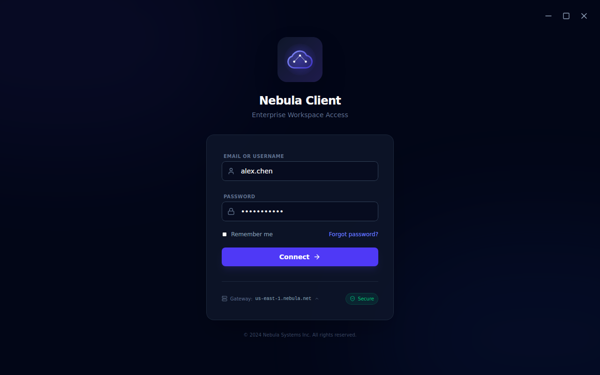
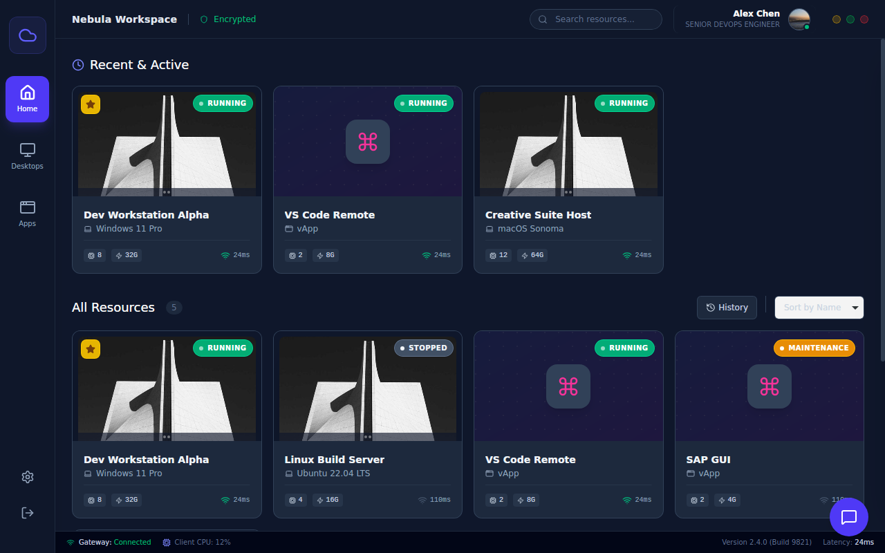

<div align="center">


# Nebula

**A Modern VDI Dashboard & AI Assistant**

[](https://tauri.app/)
[](https://react.dev/)
[](https://www.typescriptlang.org/)
[](https://tailwindcss.com/)
[](LICENSE)

[English](./README.md) | [简体中文](./README_zh-CN.md)

</div>

---

### Introduction
**Nebula** is a high-performance desktop application built with **Tauri v2** and **React**. It is designed to provide a seamless interface for Virtual Desktop Infrastructure (VDI) management, featuring a built-in AI assistant powered by **Google Gemini**.

### 📸 Preview
<div align="center">
  
  <p><em>User Login & Gateway</em></p>
  
  <br />
  
  
  <p><em>Main Dashboard & Analytics</em></p>
</div>

### ✨ Features
- **🤖 AI Assistant**: Integrated intelligent chat interface powered by `@google/genai` to assist users with operations and queries.
- **🖥️ VDI Viewer**: Dedicated interface for viewing and managing virtual desktops.
- **📊 Analytics Dashboard**: Real-time data visualization and metrics using `recharts`.
- **🎨 Modern UI/UX**: clean and responsive design built with **Tailwind CSS v4** and **Lucide React** icons.
- **🌍 Internationalization**: Built-in support for multiple languages (`LanguageContext`).
- **⚙️ Customization**: Comprehensive settings and user profile management.

### 🛠️ Tech Stack
- **Core**: [Tauri v2](https://v2.tauri.app/) (Rust + Webview)
- **Frontend**: React 19, TypeScript, Vite 7
- **Styling**: Tailwind CSS v4
- **State Management**: React Context API
- **AI Integration**: Google Gemini API
- **Visualization**: Recharts

### 🚀 Getting Started

#### Prerequisites
- **Node.js** (Latest LTS recommended)
- **pnpm** (Package manager)
- **Rust** (Required for Tauri development) - [Install Rust](https://www.rust-lang.org/tools/install)

#### Installation

1. **Clone the repository**
   ```bash
   git clone https://github.com/jience/nebula-workspace.git
   cd nebula
   ```

2. **Install dependencies**
   ```bash
   pnpm install
   ```

3. **Development Mode**
   Start the frontend and Tauri backend in development mode:
   ```bash
   pnpm tauri dev
   ```

4. **Build for Production**
   Create an optimized production build/installer:
   ```bash
   pnpm tauri build
   ```

### 📂 Project Structure
```text
nebula/
├── src/
│   ├── components/      # UI Components (Dashboard, Chat, VDI Viewer)
│   ├── contexts/        # Global state (Theme, Language)
│   ├── services/        # API services (Gemini AI)
│   └── styles/          # Tailwind setup
├── src-tauri/           # Rust backend (Tauri configuration)
└── vite.config.ts       # Vite configuration
```

### 🤝 Contributors
Thanks to all the people who contribute!
<a href="https://github.com/jience/nebula-workspace/graphs/contributors">
  
</a>

### 📄 License
This project is licensed under the [MIT License](LICENSE) - see the file for details.

